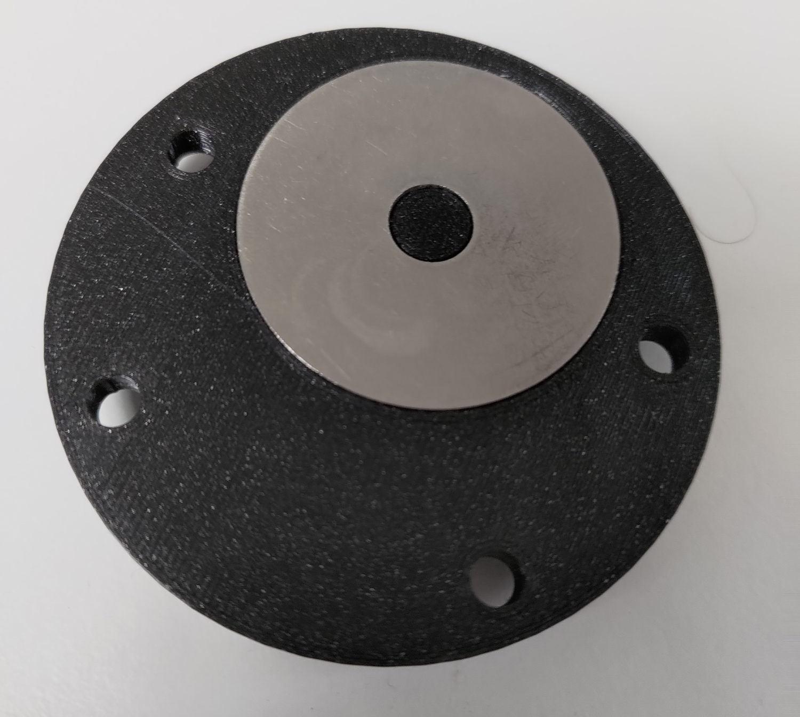
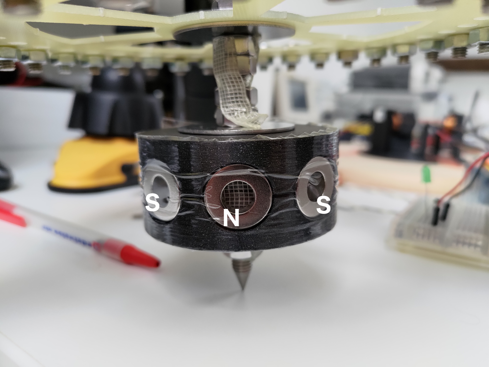
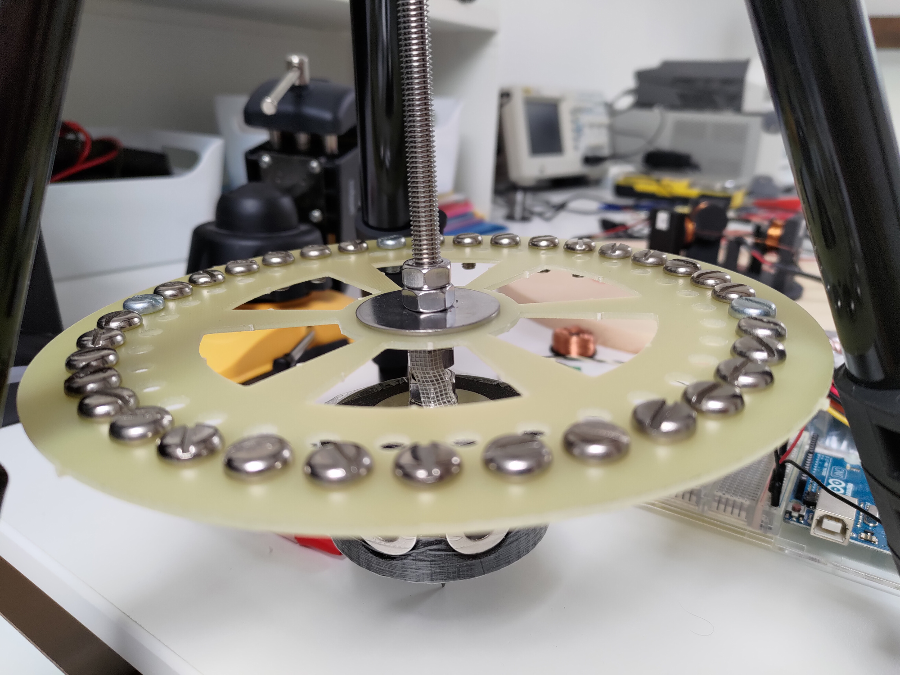

* Dummy list
{:toc}

## Key concepts

The project is built around a [Manfrotto compact action tripod](https://www.manfrotto.com/us-en/compact-action-aluminium-tripod-with-hybrid-head-black-mkcompactacn-bk/) that will be used as the support for the rest of the build. The head of the tripod is removed, and an m8 threaded stainless steel rod around 450mm long is passed through the hole in the middle of the tripod. In terms of magnets, two different kinds are used: 9 [more powerful, larger magnets](https://www.magnetiques.fr/magnetique,aimant-brut-torique-19-1mm-x-9-5mm-x-6-4mm.html) and 32 [smaller and less powerful kind.](https://www.magnetiques.fr/magnetique,aimant-brut-torique-10mm-x-5mm-x-5mm.html) Both are neodymium ring magnets.

The flywheel rod is vertical. Its weight is supported by a sharpened point end, and its alignment is ensured by a magnetic centering system. The rotor is attached to the rod, towards the bottom, and the stator is on the ground directly below the rod. The flywheel is a few centimeters above the rotor.

Starting from the bottom, the project needs a moveable flat surface to facilitate alignment of different parts of the flywheel. In this case, I used a [circular wooden plate](https://www.amazon.fr/Planche-d%C3%A9couper-ronde-circulaire-double/dp/B07V1NTN4Q/ref=d_pd_sbs_sccl_4_3/259-8809813-3185141?pd_rd_w=TDy5A&content-id=amzn1.sym.6cf0f0e9-457a-4cd7-874f-213f9aec706c&pf_rd_p=6cf0f0e9-457a-4cd7-874f-213f9aec706c&pf_rd_r=J5986YE4P2V2ZJMM0XC6&pd_rd_wg=hbfkj&pd_rd_r=82deab9f-0ef2-4c8b-b7fc-b74d2204789f&pd_rd_i=B07V1NTN4Q&psc=1#customerReviews), but any flat surface of similar dimensions works. The tripod will be placed on top of this surface in a fully opened position.

## Stator

On top of the base goes the stator. It is almost entirely 3D printed, and all the 3D models can be found [here](https://github.com/a-sc/Flywheel/tree/main/mechanics/stator). A [large m8 stainless steel washer](https://www.amazon.fr/Rondelles-Carrosserie-Inoxydable-Carrossier-ext%C3%A9rieur/dp/B0B6BS663W/ref=sr_1_25_sspa?__mk_fr_FR=%C3%85M%C3%85%C5%BD%C3%95%C3%91&crid=2RNZMAKP9CCT2&keywords=rondelle%2Bm8&qid=1673488716&s=industrial&sprefix=rondelle%2Bm8%2Cindustrial%2C99&sr=1-25-spons&sp_csd=d2lkZ2V0TmFtZT1zcF9tdGY&th=1) with an outer diameter of anywhere from 25-40mm is stuck to the bottom of the "Stator central part" model.

{:height="270px" width="300px"}
*Underside of the stator central part*

This is where the point of the rod will spin. This part is placed in the middle of the wooden plate, and around it goes the "Stator body".

*The stator body 3D model*

This part consists of 2 sets of 3 towers equidistant from the center. The 3 hall sensors are placed on the smaller towers of the stator body. 3 coils are made using the "Coil plate" and "Coil shaft" parts. This is done by inserting these two parts together without using adhesive, and wrapping 0.25mm diameter copper wire around the coil shaft until the wire comes up to the edge of the coil plate. To finish the coils, I recommend adding epoxy to the wire to stop it from moving. These 3 coils are then attached to the 3 taller towers of the stator's body. For sticking both the coils and the hall sensors to the stator's body, I used double sided tape as this gave me the most flexibility, but any adhesive works.

*Fully assembled stator*

## Rotor and flywheel

On the rod, at the same level as the stator, is the rotor. The 3D model can be found [here](https://github.com/a-sc/Flywheel/tree/main/mechanics/rotor). The 3D model is only half of the rotor, so it has to be printed twice and stuck together with something like superglue. 

*The rotor 3D model*

The rotor has 8 holes in which to put magnets. The more powerful magnets are used, and have to be placed in alternating polarities (north/south/north/south).

{:height="225px" width="300px"}
*Rotor on the threaded rod*

The flywheel that I used is a [relatively thin fiberglass disc with a radius of around 10cm](https://github.com/a-sc/Flywheel/tree/main/mechanics/flywheel_plate) and is placed slightly above the rotor. Screws are added around the outside of the flywheel to increase the moment of inertia, and the flywheel is inserted into the steel tube and fixed in place with nuts. 

{:height="225px" width="300px"}
*The flywheel I used*

In reality, any homogenous disc that fits the m8 threaded rod more or less well can be used. It does, however, need to fit inside of the tripod legs, so the diameter cannot be too large.

## Threaded rod

The threaded rod serves a few purposes: firstly, it aligns the different parts of the build vertically thanks to nuts. It also supports the weight of the build. In order for the rod to have as little friction as possible, its end has to be sharpened to a point. There are two ways to do this: one is to glue a nut to a screw and thread the nut into the end, and the other is to machine the end of the rod into a sharp point. This point is then placed on the metal washer glued to the "Stator central part", since metal on metal leads to very minimal friction. I first used the method with the screw, and the stability was satisfactory but not perfect. I later machined the end of the rod into a sharp point and there is no longer any wobbling.

*Machined sharp point*

The third and last purpose of the rod is to align all the components horizontally, such that they are always perfectly perpendicular to the floor. The 3D models used to achieve horizontal stability can be found [here](https://github.com/a-sc/Flywheel/tree/main/mechanics/central_stability). The "tripod adapter" is inserted into the hole where the tripod head originally was, and it is held in place with the "nut tripod" object. 8 M4 stainless steel bolts are inserted into the outer holes of the "tripod adapter" from the bottom. Into each of these bolts goes a "spacer magnet" piece along with 4 small magnets. All of the magnets have to be aligned in the same direction. The end of the 8 bolts are entered into the "top plate" and fixed in place with nuts.

*The tripod adapter 3D model*

*The top plate 3D model* 

A large magnet is then added to the threaded rod in the same direction as the small magnets. Its vertical positioning should be such that it is inside the cylinder created by the smaller magnets, and slightly below the middle of the cylinder so that the vertical force is slightly downwards.

*Stabilizing complex*
